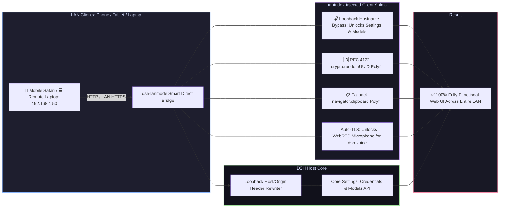

# 📦 @goodandready/dsh-lanmode

<div align="center">

<h3>Local Area Network (LAN) Access Enabler, Secure Context Shims, Direct Bridge & Auto-TLS for DeepSeek Harness</h3>

<p align="center">
  <a href="https://www.npmjs.com/package/@goodandready/dsh-lanmode"></a>
  <a href="LICENSE"></a>
  <a href="https://github.com/topics/dsh-plugin"></a>
  <a href="https://nodejs.org"></a>
</p>

<p align="center">
  <a href="README.md"><b>🇬🇧 English</b></a> •
  <a href="README.ru.md"><b>🇷🇺 Русский</b></a> •
  <a href="README.zh.md"><b>🇨🇳 中文说明</b></a>
</p>

</div>

---

## ⚡ Why DSH Fails Over Local Network (LAN)

By default, modern web browsers and the **DeepSeek Harness** frontend deliberately restrict access when opened from non-localhost IP addresses (e.g. `192.168.x.x` or `10.x.x.x`) over plain HTTP:

1. 🔒 **Locked Settings & Models Tabs**: The Web UI evaluates the hostname via `isLoopbackHostname`. If accessed over LAN, the settings service falls back to in-memory mode: all plugin configuration cards render empty, section states become `"unavailable"`, mutations are discarded before transmission, and the **Models** page displays *"settings are unavailable in this browser"*.
2. 💥 **Fatal UUID Generation Crash**: `crypto.randomUUID()` only exists in browser Secure Contexts (HTTPS or localhost). On plain HTTP across LAN, file uploads, tool calls, and session initializations crash instantly.
3. 📋 **Broken Clipboard Copying**: `navigator.clipboard` is completely disabled by browsers on non-secure origins, breaking all code snippet "Copy" buttons.
4. 🎙️ **Microphone & Voice Input Blockade**: Browser security engines block `navigator.mediaDevices.getUserMedia` on plain HTTP, making voice input via [`dsh-voice`](https://github.com/GooDAnDReaDY/dsh-voice) impossible on remote mobile phones and tablets.
5. 🛡️ **Loopback-Only Core API Fencing**: Core DSH methods (`/api/settings.*`, `/api/credentials.*`, `/api/models.*`) strictly reject requests not originating from loopback `127.0.0.1`.

`dsh-lanmode` completely resolves all these limitations through non-invasive `webServer.tapIndex` HTML shims, a smart direct bridge, and auto-generated local TLS certificates.



---

## ✨ Full Feature Breakdown

### 1. 🔓 Settings & Models Tab Unlocking (`lib/shim.js` & `lib/loopback-source.js`)
* Dynamically patches the `isLoopback` client evaluation on-the-fly inside `index.html` and the JS bundle without modifying core files on disk.
* **Preserves Real Network Topology**: While settings are unlocked for editing, the plugin retains real client origin awareness so file path links are opened on the correct machine (server vs client).

### 2. 🆔 RFC 4122 v4 `crypto.randomUUID()` Polyfill
* Injects a cryptographically sound UUID generator using `getRandomValues` (or fallback pseudo-random generator) when running on plain HTTP, eliminating crashes during file uploads and turn submissions.

### 3. 📋 Clipboard Copy Fallback
* Injects a seamless fallback using hidden `textarea` and `document.execCommand('copy')` so code block copy buttons work flawlessly on mobile browsers without HTTPS.

### 4. 🎛️ Three Operating Modes (`lib/mode.js`)
* **`direct` (Direct Listener)**: Binds a dedicated port on `0.0.0.0`, accepts LAN connections, and proxies traffic to the local loopback harness while rewriting headers.
* **`proxy` (Reverse Proxy Mode)**: For setups already behind Nginx, Caddy, or Traefik. Does not open extra ports; only injects client shims via `webServer.tapIndex`.
* **`auto` (Smart TCP Auto-Detection)**: Performs a non-blocking TCP socket knock on startup. If an existing proxy is already serving the port, it operates in `proxy` mode; otherwise, it safely spins up the direct bridge listener.

### 5. 🔐 Auto-Generated Self-Signed TLS for Microphone (`lib/tls.js`)
* Browsers strictly forbid microphone access (`getUserMedia`) on plain HTTP.
* `dsh-lanmode` uses the system's `openssl` to generate a local X.509 certificate (valid for 397 days, automatically renewed 30 days before expiration), upgrading LAN connections to HTTPS so voice input via [`dsh-voice`](https://github.com/GooDAnDReaDY/dsh-voice) works on iPhones, iPads, and Android devices.

### 6. 🛡️ CIDR Subnet Filtering & Privileged Protection (`lib/access.js`, `lib/privileged.js`, `lib/handoff.js`)
* **CIDR Subnet Filtering**: Restrict LAN access to specific IP ranges (e.g. `allowSubnets: ["192.168.1.0/24", "10.0.0.0/8"]`).
* **Privileged API Guard**: Controls whether remote clients can mutate credentials and server settings (`allowPrivileged: true/false`).
* **Pairing Handoff Tokens**: Secure token-based handshake for new devices.

### 7. 🩺 Diagnostics & Health Dashboard (`lib/health.js`)
* Access `GET /dsh-lanmode/health` to view an in-depth diagnostic JSON report:
  * Operating mode (`direct` vs `proxy`);
  * Network interfaces and bound IP addresses;
  * Active shims and TLS certificate expiration status;
  * Allowed subnets and privileged route status.

### 8. 🔍 URL Query Debugging Switches
* `?lanmode=off` — Disables all shims completely (reproduces stock locked behavior).
* `?lanmode=invert` — Simulates an external network context directly on localhost for testing.

---

## 📦 Quick Installation

```bash
dsh plugin --profile web add @goodandready/dsh-lanmode
```

> [!IMPORTANT]
> Restart DSH Web UI after installation (`systemctl --user restart dsh-web`) and reload your browser tab.

---

## ⚙️ Configuration Reference (`settings.yaml`)

```yaml
dsh-lanmode:
  enabled: true
  mode: auto             # 'auto', 'direct', or 'proxy'
  directBridge:
    enabled: true
    port: 3000
    host: 0.0.0.0
  allowSubnets:
    - 192.168.0.0/16
    - 10.0.0.0/8
    - 127.0.0.1/32
  enableTls: false        # Enable for HTTPS microphone access
  allowPrivileged: true   # Allows settings/credentials mutation from LAN
  shimLoopback: true
  shimRandomUuid: true
  shimClipboard: true
```

| Parameter | Type | Default | Description |
|---|---|---|---|
| `mode` | `string` | `auto` | Operating mode: `auto` (detect proxy), `direct` (own listener), or `proxy` |
| `directBridge.port` | `number` | `3000` | Port for the direct LAN bridge listener |
| `allowSubnets` | `string[]` | `["0.0.0.0/0"]` | Allowed CIDR IP ranges permitted to connect |
| `enableTls` | `boolean` | `false` | Automatically generates local self-signed TLS cert for HTTPS |
| `allowPrivileged` | `boolean` | `true` | Permits remote LAN clients to modify settings and API keys |
| `shimLoopback` | `boolean` | `true` | Unlocks Settings and Models tabs on non-localhost origins |
| `shimRandomUuid` | `boolean` | `true` | Injects RFC 4122 v4 `crypto.randomUUID()` polyfill |
| `shimClipboard` | `boolean` | `true` | Injects `navigator.clipboard` fallback copy handler |

---

## 📄 License

MIT © [GooDAnDReaDY](https://github.com/GooDAnDReaDY)
