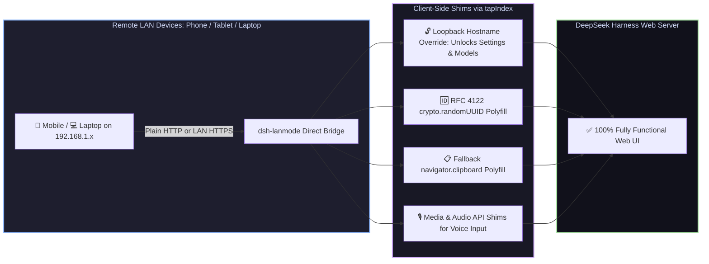

# 📦 @goodandready/dsh-lanmode

<div align="center">

<h3>Local Network (LAN) Access Enabler, Secure Context Shims & Direct Bridge for DeepSeek Harness</h3>

<p align="center">
  <a href="https://www.npmjs.com/package/@goodandready/dsh-lanmode"></a>
  <a href="LICENSE"></a>
  <a href="https://github.com/topics/dsh-plugin"></a>
  <a href="https://nodejs.org"></a>
</p>

<p align="center">
  <a href="README.md"><b>🇬🇧 English</b></a> •
  <a href="README.ru.md"><b>🇷🇺 Русский</b></a> •
  <a href="README.zh.md"><b>🇨🇳 中文说明</b></a>
</p>

</div>

---

## ⚡ Overview

**`dsh-lanmode`** unlocks full, unrestricted access to the **DeepSeek Harness** Web UI across your local area network (LAN `192.168.x.x` / `10.x.x.x`) from mobile phones, tablets, laptops, and remote workstations.

By default, modern web browsers and the DSH web frontend lock down essential features when accessed over plain HTTP from non-localhost IPs:
1. **Disabled Settings & Models**: The Web UI detects non-loopback hostnames (`!isLoopbackHostname`) and locks the **Settings** tab and **Models** page with `"settings are unavailable in this browser"`.
2. **Broken UUID Generation**: `crypto.randomUUID()` is disabled by browsers on non-HTTPS origins, causing API errors and failed uploads.
3. **Broken Clipboard Copying**: `navigator.clipboard` is blocked on HTTP, disabling "Copy" buttons.
4. **Blocked Microphone APIs**: Browsers block Web Audio & microphone access for voice input plugins like `dsh-voice`.

`dsh-lanmode` injects non-invasive shims via `webServer.tapIndex`, hosts a direct bridge listener, and provides auto-generated TLS certificates to restore 100% feature parity on LAN.



---

## ✨ Key Capabilities & Shims

* 🔓 **Settings & Models Tab Unlock**: Overrides the internal `isLoopbackHostname` restriction in the client bundle, restoring full read/write access to **Settings**, **Plugin Cards**, and **Models** from any device on your LAN.
* 🆔 **RFC 4122 `crypto.randomUUID()` Polyfill**: Injects a cryptographically robust UUID generator when running in non-secure HTTP contexts, preventing client crashes during file uploads and session creation.
* 📋 **Clipboard Copy Polyfill**: Injects a fallback copy pipeline using `document.execCommand('copy')` so code snippet copy buttons work on mobile browsers.
* 🎙️ **Microphone & Voice Input Support**: Enables audio capture compatibility for [`dsh-voice`](https://github.com/GooDAnDReaDY/dsh-voice) across LAN.
* 🛡️ **Subnet CIDR Access Control**: Restrict LAN access using strict CIDR notation (e.g. `allowSubnets: ["192.168.1.0/24"]`).
* 🔒 **Automatic Self-Signed TLS (`tls.js`)**: Optionally spins up an HTTPS listener with on-the-fly generated certificates for native iOS Safari WebRTC compatibility.
* 🩺 **Diagnostics & Health Dashboard**: Live status report available at `GET /dsh-lanmode/health` detailing network interfaces and active shims.

---

## 📦 Quick Installation

```bash
dsh plugin --profile web add @goodandready/dsh-lanmode
```

> [!IMPORTANT]
> Restart DSH Web UI after installation (`systemctl --user restart dsh-web`) and refresh any open browser tabs.

---

## ⚙️ Configuration Reference (`settings.yaml`)

```yaml
dsh-lanmode:
  enabled: true
  directBridge:
    enabled: true
    port: 3000
    host: 0.0.0.0
  allowSubnets:
    - 192.168.0.0/16
    - 10.0.0.0/8
    - 127.0.0.1/32
  enableTls: false
  shimLoopback: true
  shimRandomUuid: true
  shimClipboard: true
```

---

## 📄 License

MIT © [GooDAnDReaDY](https://github.com/GooDAnDReaDY)
