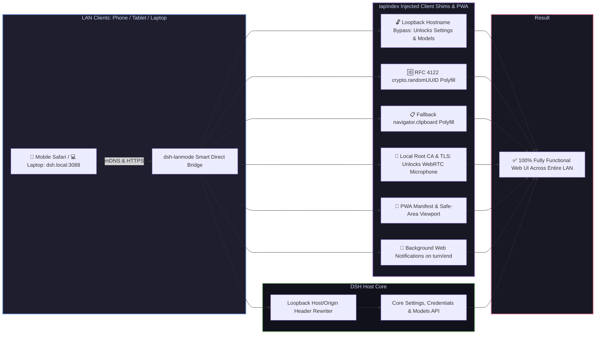

# 📦 @goodandready/dsh-lanmode

**Alpha.5 compatibility hotfix:** async browser plugin initialization now
retains its awaited lifecycle. See [compatibility and tests](docs/testing/alpha5-compatibility.md)
and [0.6.11 patch notes](docs/releases/0.6.11.md).

<div align="center">

<h3>Local Area Network (LAN) Access Enabler, mDNS (dsh.local), PWA, Root CA, QR Code, Background Notifications & Auto-TLS for DeepSeek Harness</h3>

<p align="center">
  <a href="https://www.npmjs.com/package/@goodandready/dsh-lanmode"></a>
  <a href="LICENSE"></a>
  <a href="https://github.com/topics/dsh-plugin"></a>
  <a href="https://nodejs.org"></a>
</p>

<p align="center">
  <a href="https://goodandready.app/"></a>
</p>

<p align="center">
  <a href="README.md"><b>🇬🇧 English</b></a> •
  <a href="README.ru.md"><b>🇷🇺 Русский</b></a> •
  <a href="README.zh.md"><b>🇨🇳 中文说明</b></a>
</p>

<table align="center">
  <tr>
    <td align="center">
      ⭐ <strong>If you like this plugin, please star it on GitHub</strong> — it shows me that the plugin is useful to you and motivates me to keep developing it.
      <br><br>
      🐛 <strong>If you find a bug or would like to request a feature</strong>, open a GitHub issue in any language — I will review your proposal and implement useful suggestions in a future plugin version.
    </td>
  </tr>
</table>

</div>

---

## ⚡ Why DSH Fails Over Local Network (LAN)

By default, modern web browsers and the **DeepSeek Harness** frontend deliberately restrict access when opened from non-localhost IP addresses (e.g. `192.168.x.x` or `10.x.x.x`) over plain HTTP:

1. 🔒 **Locked Settings & Models Tabs**: The Web UI evaluates the hostname via `isLoopbackHostname`. If accessed over LAN, the settings service falls back to in-memory mode: all plugin configuration cards render empty, section states become `"unavailable"`, mutations are discarded before transmission, and the **Models** page displays *"settings are unavailable in this browser"*.
2. 💥 **Fatal UUID Generation Crash**: `crypto.randomUUID()` only exists in browser Secure Contexts (HTTPS or localhost). On plain HTTP across LAN, file uploads, tool calls, and session initializations crash instantly.
3. 📋 **Broken Clipboard Copying**: `navigator.clipboard` is completely disabled by browsers on non-secure origins, breaking all code snippet "Copy" buttons.
4. 🎙️ **Microphone & Voice Input Blockade**: Browser security engines block `navigator.mediaDevices.getUserMedia` on plain HTTP, making voice input via [`dsh-voice`](https://github.com/GooDAnDReaDY/dsh-voice) impossible on remote mobile phones and tablets.
5. 🛡️ **Loopback-Only Core API Fencing**: Core DSH methods (`/api/settings.*`, `/api/credentials.*`, `/api/models.*`) strictly reject requests not originating from loopback `127.0.0.1`.

`dsh-lanmode` completely resolves all these limitations through non-invasive `webServer.tapIndex` HTML shims, a smart direct bridge, mDNS, Root CA generation, and an interactive settings card.



---

## ✨ Full Feature Breakdown

### 1. 📱 `/mobileqr` Command & Instant QR Code Access
* Registers tool `/mobileqr`: generates a clean SVG QR code with the active LAN URL and session token (`https://dsh.local:3088/?token=...`). Point your phone camera at the screen to connect immediately.
* QR codes are also accessible in the Settings card and on `/dsh-lanmode/health`.

### 2. 📲 PWA & Mobile Standalone Mode
* Route `/dsh-lanmode/manifest.json` and meta tags `viewport-fit=cover`, `apple-mobile-web-app-capable`, `theme-color`.
* Mobile layout styles are injected with `data-dsh-plugin="dsh-lanmode"`, so the harness can tell them apart from other plugins.
* Adding DSH to your Home Screen on iOS/Android launches it as a standalone app without browser URL bars and with notch-aware safe areas.
* `GET /dsh-lanmode/manifest.webmanifest` is public, so the home-screen install does not depend on a session.
* A saved launch token can reopen that bookmark. Clearing site data drops the token.
* Scan `/dsh-lanmode/pair-accept?token=` to pair a phone without setting a cookie. Empty tokens and tokens longer than 512 characters are rejected.
* On a phone, the QR action sits on the same footer row as settings. A long press on a session row opens its menu. The model menu stays pinned to the bottom of the screen. Wide desktop panels close on a narrow screen; other plugins remain visible.
* Chat links and file opens whose path ends in zip, exe, dmg, pkg, msi, 7z, rar, gz, bz2, iso, bin, or apk download instead of opening in the page.

### 3. 🌐 Automatic mDNS (`dsh.local`)
* Built-in lightweight UDP 5353 responder: announces **`dsh.local`** across your local network. No need to memorize shifting IP addresses.

### 4. 🔐 Local Root CA for Permanent Trusted HTTPS
* Generates a two-tier certificate structure: **`dsh-lanmode Local Root CA`** (10-year validity) $\rightarrow$ **`Server Certificate`** (with SAN for `dsh.local`, LAN IPs, and localhost).
* Download `GET /dsh-lanmode/ca.crt`: install the profile once on your iPhone, iPad, or Android to enjoy persistent trusted HTTPS. Voice input via [`dsh-voice`](https://github.com/GooDAnDReaDY/dsh-voice) works flawlessly.
* The saved certificate is reused across restarts. A newly issued certificate also lists sslip.io and nip.io names for each address.
* Those names belong on the certificate only. The bridge does not listen on sslip.io or nip.io host names.
* `tlsSites` adds extra certificate and key files for specific host names. A request for that name uses its own certificate. IP addresses, localhost, and unknown names stay on the default certificate. An empty list does not enable name selection.

### 5. 🔔 Background Web Notifications (turn/end)
* Hooks into `turn/end` and `approval/asked` session events.
* When the tab or phone is inactive (`document.hidden`), dispatches a native push notification. Tapping the notification immediately refocuses the chat window.

### 6. 🎨 Settings Card in «Settings → Plugins» (`lib/client.js`)
* Interactive plugin card following DSH design guidelines:
  * Connection status & active mode;
  * One-click LAN URL copying;
  * In-card QR code toggle;
  * One-click background notification toggle;
  * Download Root CA link (`ca.crt`).

### 7. 🛡️ Access Control, LAN PIN & Security
* **`unlockPrivileged`**: Master gate for settings & credentials mutation from LAN.
* **`lanPin` / `lanPinRef`**: Optional PIN protection for privileged operations. When enabled, LAN guests can chat freely, but changing system settings, installing plugins, or mutating credentials requires PIN verification.
* **Brute-Force Rate Limiting**: PIN authentication enforces automatic rate limiting (HTTP 429 status after 5 consecutive failed attempts per IP) with temporary lockout.
* **Subnet Role Separation**: Distinct `adminAllow` and `guestAllow` CIDR rules. Subnets designated under `guestAllow` are strictly prohibited from mutating system settings, revoking sessions, or toggling WAN tunnels (`403 Forbidden`).
* **Administrative & Diagnostic Endpoints Protection**: Internal plugin routes (`/dsh-lanmode/devices`, `/dsh-lanmode/devices/revoke`, `/dsh-lanmode/devices/kill-all`, `/dsh-lanmode/tunnel/toggle`, `/dsh-lanmode/api/interfaces`, `/dsh-lanmode/api/telemetry`, `/dsh-lanmode/api/config`) feature built-in fail-closed defense-in-depth authorization. Bypassing the local bridge or accessing from untrusted networks requires valid admin credentials or trusted loopback origins.
* Login, settings, device revoke, and tunnel toggle stop reading a body after 64 KiB and answer 413. The action is not applied.
* **CSRF Mitigation**: Mutating POST requests reject cross-site invocations (`Sec-Fetch-Site: cross-site`) and validate origin headers.
* Passwords are stored as scrypt digests. Session tokens are stored as SHA-256 digests, not as the raw token. Changing the password revokes that user's other sessions immediately.
* Login takes the same time when the username is unknown as when the password is wrong.
* The LAN PIN is stretched with PBKDF2. Five failures lock that address for 15 minutes.
* Set the first password, password reference, or `passwordAuth: true` from the machine itself. A remote address receives 403 and the configuration is left unchanged.
* While password authentication stays on, a settings update cannot clear both the password and the password reference. Turning password authentication off is still allowed.
* `POST /dsh-lanmode/bans` with `{ "ip" }` bans an address. That address then receives plain `403 Forbidden` before the login page. Loopback and the administrator's own address cannot be banned. The list is kept beside the device registry.
* `disabledUsers` names accounts whose sessions are dropped within 5 seconds.
* Forwarded client addresses (`X-Forwarded-For`, `CF-Connecting-IP`) are trusted only from peers listed in `trustedProxyCidrs`. Direct peers cannot spoof their address.
* If a signed-in API call returns 401 with `x-dsh-auth-required: 1`, the page asks for the password again without navigating away, so the current draft stays.
* The login card shows the host name you are signing into.

### 8. 📱 Connected Devices & Session Management
* Live client presence tracking and device OS/browser discovery (iOS, Android, Windows, macOS, Linux).
* Per-device token revocation and emergency "Revoke All Others" kill switch in the settings card.
* Bridge routes that list or revoke devices require administrator access. Guests receive 403.
* Each device row can show a short name taken from the User-Agent.
* If the device list, tunnel status, update check, or latency request fails, the card shows that failure instead of an empty success.

### 9. 🌐 Multi-Interface & Mesh Detection
* Automatic identification of local LAN, Tailscale (100.x.y.z), WireGuard, and VPN network adapters with quick-select UI pills.
* Automated firewall management for Windows Defender Firewall, Linux UFW, and firewalld.

### 10. ⚡ Live Network Telemetry & HTTP/2 ALPN
* Compact real-time telemetry widget displaying RTT ping latency, active concurrent connections, and streaming data volume.
* Native HTTP/2 (ALPN `h2`) bridge support alongside HTTP/1.1 for multiplexed low-latency streaming.

### 11. 🚀 Connection Pooling & SSE Streaming Isolation
* Upstream connections to DeepSeek Harness are segregated into two independent pools:
  * **Standard HTTP Pool**: Keep-alive enabled with up to 100 reusable sockets for rapid loading of WebUI assets, static scripts, and REST endpoints. Protected by a queue timeout (15s default) returning HTTP 503 rather than stalling indefinitely if saturated.
  * **Dedicated Streaming Pool**: Independent unpooled socket handling for long-lived Server-Sent Events (SSE), token streaming (`/api/chat/stream`), and live notifications. 100+ concurrent streaming clients can run without exhausting or starving WebUI static and API traffic. Response bodies are piped through; they are not buffered into one blob.
* Local LAN clients skip gzip and brotli. Remote clients can still receive compressed responses when `adaptiveCompression` is on (the default).
* If the harness port is not configured, the bridge probes `127.0.0.1` on 3080, then 3081, then 3082. An explicit port is used as given.

### 12. ☁️ Cloudflare WAN Tunnels & Tunnel PIN
* Built-in zero-config Quick Tunnels and Named Tunnels for remote WAN access without port forwarding.
* Mandatory WAN PIN challenge (`tunnelPin: true`) preventing unauthorized external access.

### 13. 🔄 In-App One-Click Plugin Updates
* Built-in updater service and settings card UI (`/api/dsh-lanmode/update`):
  * Real-time display of the currently installed version and availability of new releases from the npm registry;
  * Security perimeter: mandatory `x-dsh-plugin-update: 1` header, same-origin check, and the admin gate. Password authentication requires a valid session even from loopback. Without it, loopback or an admin-role address is accepted. Guests are rejected;
  * One-click upgrade of `@goodandready/dsh-lanmode` directly from the DSH settings card with zero terminal commands required.

---

## 📦 Quick Installation

```bash
dsh plugin --profile web add @goodandready/dsh-lanmode
```

---

## ⚙️ Configuration Reference (profile `cordis.patch.yml`)

Since v0.8.0 (DSH 0.1.7+), all configuration lives in the profile row `config:` section.
Edit your profile's `cordis.patch.yml` to override defaults:

```yaml
# ~/.dsh/profiles/web/cordis.patch.yml
- id: dsh-lanmode
  config:
    mode: direct             # 'direct', 'proxy', or 'auto'
    directHost: 0.0.0.0      # Default: 127.0.0.1 (localhost only)
    directPort: 3080
    mdns: true               # Announce dsh.local in LAN
    pwa: true                # PWA manifest, splash screen & mobile viewport
    mobileEnterSends: false  # When false (default), Enter adds newline on mobile touch
    tls: self-signed         # 'self-signed' (with Root CA), 'files', or 'off'
    unlockPrivileged: true   # Permit settings & credentials from LAN
    lanPinRef: ""            # Credential reference name or ENV var for LAN PIN
    tunnel: off              # Cloudflare WAN tunnel: 'off', 'quick', or 'named'
    tunnelTokenRef: ""       # Credential reference name or ENV var for tunnel token
    tunnelPin: true          # Require PIN for requests from WAN
    allow:                   # Default: ['127.0.0.0/8'] (loopback only)
      - 192.168.0.0/16
      - 10.0.0.0/8
    passwordAuth: false      # Require a username and password
    authPasswordRef: ""      # Credential name for the password; do not put the password here
    publicHost: ""           # Host name shown on the login card
    disabledUsers: []        # Usernames whose sessions are revoked
    trustedProxyCidrs: []    # Peers allowed to set X-Forwarded-For
    tlsSites: []             # Extra {host, cert, key} certificates by server name
    adaptiveCompression: true
```

---

## 📄 License

MIT © [GooDAnDReaDY](https://github.com/GooDAnDReaDY)
