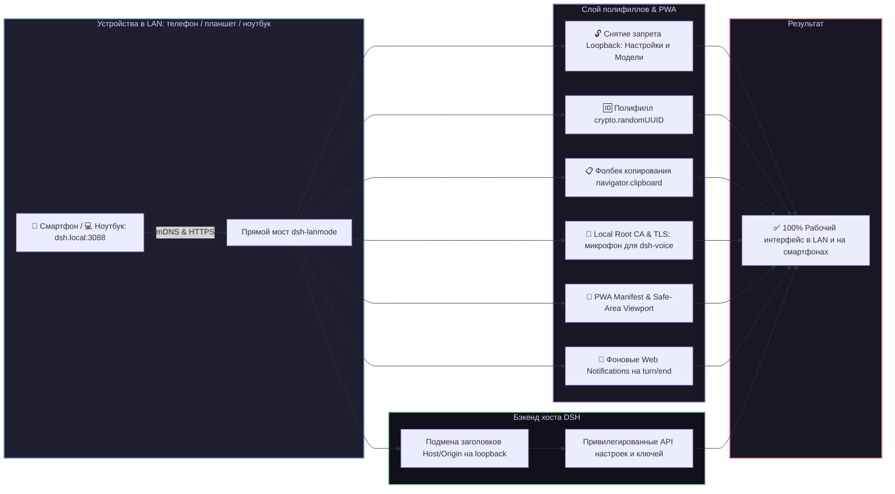

# 📦 @goodandready/dsh-lanmode

**Исправлена совместимость с DSH 0.1.2-alpha.5:** загрузчик корректно ожидает
асинхронный запуск плагинов. [Проверки](docs/testing/alpha5-compatibility.md)
и [патчноут 0.6.11](docs/releases/0.6.11.md).

<div align="center">

<h3>Доступ к веб-интерфейсу по локальной сети (LAN), mDNS (dsh.local), PWA, Root CA, QR-код, фоновые уведомления и авто-TLS для DeepSeek Harness</h3>

<p align="center">
  <a href="https://www.npmjs.com/package/@goodandready/dsh-lanmode"></a>
  <a href="LICENSE"></a>
  <a href="https://github.com/topics/dsh-plugin"></a>
  <a href="https://nodejs.org"></a>
</p>

<p align="center">
  <a href="https://goodandready.app/"></a>
</p>

<p align="center">
  <a href="README.md"><b>🇬🇧 English</b></a> •
  <a href="README.ru.md"><b>🇷🇺 Русский</b></a> •
  <a href="README.zh.md"><b>🇨🇳 中文说明</b></a>
</p>

</div>

---

## ⚡ Почему DSH ломается при входе по локальной сети (LAN)

По умолчанию современные браузеры и веб-интерфейс **DeepSeek Harness** блокируют ключевой функционал при открытии страницы по обычному HTTP с IP-адресов локальной сети (например, `192.168.x.x` или `10.x.x.x`):

1. 🔒 **Блокировка настроек и моделей**: клиентская часть проверяет имя хоста через `isLoopbackHostname`. В сети служба настроек переходит в аварийный режим «памяти»: все карточки плагинов пустые, вкладки получают статус `"unavailable"`, изменения отбрасываются до отправки, а страница **Модели** выводит *"settings are unavailable in this browser"*.
2. 💥 **Падение генерации UUID**: метод `crypto.randomUUID()` существует только в безопасном контексте (HTTPS или localhost). На чистом HTTP в LAN загрузка файлов, вызовы инструментов и создание сессий мгновенно падают.
3. 📋 **Блокировка буфера обмена**: `navigator.clipboard` полностью отключен браузером на HTTP, из-за чего кнопки копирования кода не реагируют на нажатия.
4. 🎙️ **Запрет микрофона для голосового ввода**: браузеры блокируют `navigator.mediaDevices.getUserMedia` на HTTP, делая голосовой ввод через [`dsh-voice`](https://github.com/GooDAnDReaDY/dsh-voice) невозможным на мобильных устройствах.
5. 🛡️ **Защита API ядра**: ядро DSH разрешает методы настроек и ключей (`/api/settings.*`, `/api/credentials.*`, `/api/models.*`) только клиентам с петли `127.0.0.1`.

`dsh-lanmode` полностью решает эти проблемы через внедрение полифиллов в `index.html`, запуск прямого моста, авто-mDNS, Root CA и клиентскую карточку настроек.



---

## ✨ Полный обзор возможностей

### 1. 📱 Команда `/mobileqr` и быстрый вход по QR-коду
* Регистрирует команду/инструмент `mobileqr`: мгновенно формирует чистый SVG QR-код с готовой ссылкой и сессионным токеном (`https://dsh.local:3088/?token=...`). Наведите камеру телефона на монитор — и вы сразу в чате.
* QR-код также доступен в карточке настроек и на странице `/dsh-lanmode/health`.

### 2. 📲 PWA и Standalone-режим
* Роут `/dsh-lanmode/manifest.json` и метатеги `viewport-fit=cover`, `apple-mobile-web-app-capable`, `theme-color`.
* При добавлении сайта «На экран Домой» на iOS/Android интерфейс открывается на весь экран без адресной строки браузера и с правильными отступами под «чёлку».

### 3. 🌐 Автоматический mDNS (`dsh.local`)
* Встроенный легковесный responder на UDP 5353: анонсирует имя **`dsh.local`** в локальной сети.
* Больше не нужно вспоминать и вводить меняющиеся IP-адреса хоста.

### 4. 🔐 Локальный Root CA для постоянного доверенного HTTPS
* Плагин генерирует связку: **`dsh-lanmode Local Root CA`** (срок 10 лет) $\rightarrow$ **`Server Certificate`** (с SAN для `dsh.local`, LAN IP и localhost).
* Доступен маршрут `GET /dsh-lanmode/ca.crt`: установите профиль CA на iPhone, iPad или Android — и навсегда забудьте о предупреждениях браузера. Микрофон в [`dsh-voice`](https://github.com/GooDAnDReaDY/dsh-voice) работает штатно.

### 5. 🔔 Фоновые системные уведомления (Web Notifications API)
* Перехватывает завершение генерации хода агента (`turn/end`) и запрос подтверждений (`approval/asked`).
* Если вкладка свёрнута или экран телефона заблокирован (`document.hidden`), отправляет системный push. Клик по уведомлению моментально разворачивает чат.

### 6. 🎨 Клиентская карточка в «Настройки → Плагины» (`lib/client.js`)
* Интерактивная карточка в едином дизайн-коде DSH:
  * Статус HTTPS/HTTP и режим работы.
  * Кнопка быстрого копирования LAN URL.
  * Интерактивный QR-код прямо в настройках.
  * Кнопка включения фоновых уведомлений.
  * Ссылка на скачивание Root CA (`ca.crt`).

### 7. 🛡️ Контроль доступа и опциональный LAN PIN
* **`unlockPrivileged`**: общий переключатель доступа к настройкам и ключам из LAN.
* **`lanPin`**: опциональный PIN-код (по умолчанию отключен). Если задан, гости из LAN могут пользоваться чатом, но для доступа к системным настройкам и ключам API требуется ввод PIN-кода.
* **CIDR-фильтрация**: ограничение круга доверенных подсетей (`allow: ["192.168.77.0/24"]`).

---

## 📦 Быстрая установка

```bash
dsh plugin --profile web add @goodandready/dsh-lanmode
```

---

## ⚙️ Пример конфигурации (`settings.yaml`)

```yaml
dsh-lanmode:
  mode: direct             # 'direct', 'proxy' или 'auto'
  directHost: 0.0.0.0
  directPort: 3088
  mdns: true               # Анонс dsh.local в LAN
  pwa: true                # PWA manifest и мобильный viewport
  tls: self-signed         # 'self-signed' (с Root CA), 'files' или 'off'
  unlockPrivileged: true   # Разрешить настройки и ключи из LAN
  lanPin: ""               # Опциональный PIN для защиты настроек из LAN
  allow:
    - 192.168.0.0/16
    - 10.0.0.0/8
```

---

## 📄 Лицензия

MIT © [GooDAnDReaDY](https://github.com/GooDAnDReaDY)
