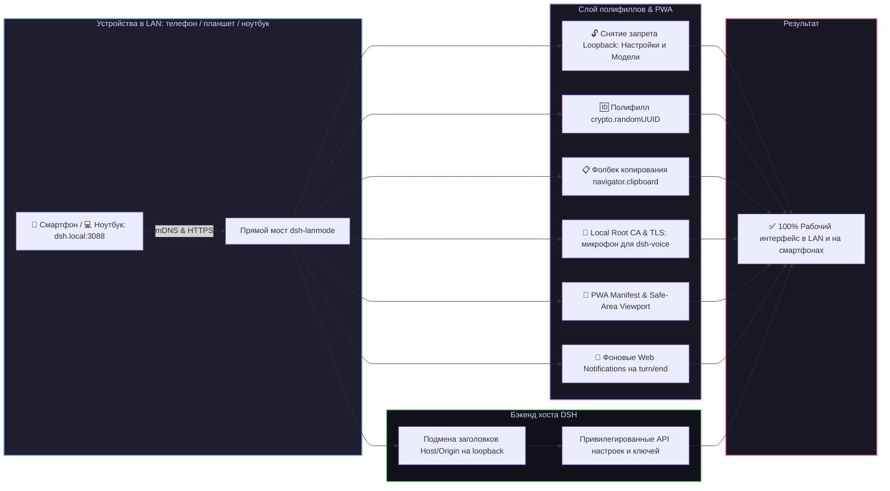

# 📦 @goodandready/dsh-lanmode

**Исправлена совместимость с DSH 0.1.2-alpha.5:** загрузчик корректно ожидает
асинхронный запуск плагинов. [Проверки](docs/testing/alpha5-compatibility.md)
и [патчноут 0.6.11](docs/releases/0.6.11.md).

<div align="center">

<h3>Доступ к веб-интерфейсу по локальной сети (LAN), mDNS (dsh.local), PWA, Root CA, QR-код, фоновые уведомления и авто-TLS для DeepSeek Harness</h3>

<p align="center">
  <a href="https://www.npmjs.com/package/@goodandready/dsh-lanmode"></a>
  <a href="LICENSE"></a>
  <a href="https://github.com/topics/dsh-plugin"></a>
  <a href="https://nodejs.org"></a>
</p>

<p align="center">
  <a href="https://goodandready.app/"></a>
</p>

<p align="center">
  <a href="README.md"><b>🇬🇧 English</b></a> •
  <a href="README.ru.md"><b>🇷🇺 Русский</b></a> •
  <a href="README.zh.md"><b>🇨🇳 中文说明</b></a>
</p>

<table align="center">
  <tr>
    <td align="center">
      ⭐ <strong>Если вам нравится этот плагин, поставьте ему звезду на GitHub</strong> — это покажет мне, что плагин вам полезен, и будет мотивировать меня развивать его дальше.
      <br><br>
      🐛 <strong>Если вы нашли баг или хотите предложить новый функционал</strong>, создайте issue на GitHub на любом языке — я рассмотрю ваше предложение и реализую полезные идеи в одной из следующих версий плагина.
    </td>
  </tr>
</table>

</div>

---

## ⚡ Почему DSH ломается при входе по локальной сети (LAN)

По умолчанию современные браузеры и веб-интерфейс **DeepSeek Harness** блокируют ключевой функционал при открытии страницы по обычному HTTP с IP-адресов локальной сети (например, `192.168.x.x` или `10.x.x.x`):

1. 🔒 **Блокировка настроек и моделей**: клиентская часть проверяет имя хоста через `isLoopbackHostname`. В сети служба настроек переходит в аварийный режим «памяти»: все карточки плагинов пустые, вкладки получают статус `"unavailable"`, изменения отбрасываются до отправки, а страница **Модели** выводит *"settings are unavailable in this browser"*.
2. 💥 **Падение генерации UUID**: метод `crypto.randomUUID()` существует только в безопасном контексте (HTTPS или localhost). На чистом HTTP в LAN загрузка файлов, вызовы инструментов и создание сессий мгновенно падают.
3. 📋 **Блокировка буфера обмена**: `navigator.clipboard` полностью отключен браузером на HTTP, из-за чего кнопки копирования кода не реагируют на нажатия.
4. 🎙️ **Запрет микрофона для голосового ввода**: браузеры блокируют `navigator.mediaDevices.getUserMedia` на HTTP, делая голосовой ввод через [`dsh-voice`](https://github.com/GooDAnDReaDY/dsh-voice) невозможным на мобильных устройствах.
5. 🛡️ **Защита API ядра**: ядро DSH разрешает методы настроек и ключей (`/api/settings.*`, `/api/credentials.*`, `/api/models.*`) только клиентам с петли `127.0.0.1`.

`dsh-lanmode` полностью решает эти проблемы через внедрение полифиллов в `index.html`, запуск прямого моста, авто-mDNS, Root CA и клиентскую карточку настроек.



---

## ✨ Полный обзор возможностей

### 1. 📱 Команда `/mobileqr` и быстрый вход по QR-коду
* Регистрирует команду/инструмент `mobileqr`: мгновенно формирует чистый SVG QR-код с готовой ссылкой и сессионным токеном (`https://dsh.local:3088/?token=...`). Наведите камеру телефона на монитор — и вы сразу в чате.
* QR-код также доступен в карточке настроек и на странице `/dsh-lanmode/health`.

### 2. 📲 PWA и Standalone-режим
* Роут `/dsh-lanmode/manifest.json` и метатеги `viewport-fit=cover`, `apple-mobile-web-app-capable`, `theme-color`.
* Мобильные стили вставляются с `data-dsh-plugin="dsh-lanmode"`, чтобы harness отличал их от стилей других плагинов.
* При добавлении сайта «На экран Домой» на iOS/Android интерфейс открывается на весь экран без адресной строки браузера и с правильными отступами под «чёлку».
* `GET /dsh-lanmode/manifest.webmanifest` публичный: установка на домашний экран не зависит от сессии.
* Сохранённый токен запуска снова открывает эту закладку. Очистка данных сайта удаляет токен.
* Ссылка `/dsh-lanmode/pair-accept?token=` спаривает телефон и не ставит cookie. Пустой токен и токен длиннее 512 символов отклоняются.
* На телефоне QR и настройки стоят в одном ряду подвала. Долгое нажатие на строку сессии открывает её меню. Меню модели прижато к низу экрана. На узком экране широкие панели закрываются, остальные плагины остаются видимыми.
* Ссылки и открытия файлов с окончанием zip, exe, dmg, pkg, msi, 7z, rar, gz, bz2, iso, bin или apk скачиваются, а не открываются на странице.

### 3. 🌐 Автоматический mDNS (`dsh.local`)
* Встроенный легковесный responder на UDP 5353: анонсирует имя **`dsh.local`** в локальной сети.
* Больше не нужно вспоминать и вводить меняющиеся IP-адреса хоста.

### 4. 🔐 Локальный Root CA для постоянного доверенного HTTPS
* Плагин генерирует связку: **`dsh-lanmode Local Root CA`** (срок 10 лет) $\rightarrow$ **`Server Certificate`** (с SAN для `dsh.local`, LAN IP и localhost).
* Доступен маршрут `GET /dsh-lanmode/ca.crt`: установите профиль CA на iPhone, iPad или Android — и навсегда забудьте о предупреждениях браузера. Микрофон в [`dsh-voice`](https://github.com/GooDAnDReaDY/dsh-voice) работает штатно.
* Сохранённый сертификат переживает перезапуск. Новый сертификат также содержит имена sslip.io и nip.io для каждого адреса.
* Эти имена только в сертификате. Мост не слушает на именах sslip.io или nip.io.
* `tlsSites` добавляет файлы сертификата и ключа для конкретных имён. Запрос с таким именем получает свой сертификат. IP, localhost и неизвестные имена остаются на сертификате по умолчанию. Пустой список выбор по имени не включает.

### 5. 🔔 Фоновые системные уведомления (Web Notifications API)
* Перехватывает завершение генерации хода агента (`turn/end`) и запрос подтверждений (`approval/asked`).
* Если вкладка свёрнута или экран телефона заблокирован (`document.hidden`), отправляет системный push. Клик по уведомлению моментально разворачивает чат.

### 6. 🎨 Клиентская карточка в «Настройки → Плагины» (`lib/client.js`)
* Интерактивная карточка в едином дизайн-коде DSH:
  * Статус HTTPS/HTTP и режим работы.
  * Кнопка быстрого копирования LAN URL.
  * Интерактивный QR-код прямо в настройках.
  * Кнопка включения фоновых уведомлений.
  * Ссылка на скачивание Root CA (`ca.crt`).

### 7. 🛡️ Контроль доступа, LAN PIN и безопасность
* **`unlockPrivileged`**: общий переключатель доступа к настройкам и ключам из LAN.
* **`lanPin` / `lanPinRef`**: опциональный PIN-код (по умолчанию отключен). Если задан, гости из LAN могут пользоваться чатом, но для доступа к системным настройкам, установке плагинов и ключам API требуется ввод PIN-кода.
* **Защита от перебора (Brute-Force)**: Встроенное ограничение попыток ввода PIN (HTTP 429 при 5 неверных попытках с одного IP) с временной блокировкой.
* **Разделение ролей подсетей**: Раздельные списки `adminAllow` и `guestAllow`. Для подсетей из `guestAllow` заблокированы любые попытки изменения настроек, сброса сессий или переключения WAN-туннеля (`403 Forbidden`).
* **Защита административных и диагностических маршрутов**: Внутренние маршруты плагина (`/dsh-lanmode/devices`, `/dsh-lanmode/devices/revoke`, `/dsh-lanmode/devices/kill-all`, `/dsh-lanmode/tunnel/toggle`, `/dsh-lanmode/api/interfaces`, `/dsh-lanmode/api/telemetry`, `/dsh-lanmode/api/config`) оснащены эшелонированной защитой. Прямое обращение требует валидной сессии администратора или доверенного loopback-источника.
* Вход, настройки, отзыв устройства и переключение туннеля перестают читать тело после 64 КиБ и отвечают 413. Действие не применяется.
* **Защита от CSRF**: Все модифицирующие POST-запросы отклоняют кросс-сайтовые вызовы (`Sec-Fetch-Site: cross-site`) и сверяют заголовки источников.
* Пароли хранятся как дайджесты scrypt. Токены сессий хранятся как дайджесты SHA-256, не как исходный токен. Смена пароля сразу отзывает остальные сессии этого пользователя.
* Вход занимает одинаковое время, когда пользователя нет и когда пароль неверен.
* PIN растягивается через PBKDF2. Пять ошибок блокируют этот адрес на 15 минут.
* Первый пароль, ссылку на пароль или `passwordAuth: true` можно задать только с самой машины. Удалённый адрес получает 403, конфигурация не меняется.
* Пока вход по паролю включён, нельзя одновременно очистить пароль и ссылку на пароль. Выключить вход по паролю по-прежнему можно.
* `POST /dsh-lanmode/bans` с телом `{ "ip" }` банит адрес. Этот адрес получает обычный текст `403 Forbidden` до страницы входа. Loopback и собственный адрес администратора забанить нельзя. Список хранится рядом с реестром устройств.
* Имена из `disabledUsers` теряют сессии в течение 5 секунд.
* Пересланный адрес клиента (`X-Forwarded-For`, `CF-Connecting-IP`) принимается только от узлов из `trustedProxyCidrs`. Прямой клиент не может подменить свой адрес.
* Если уже открытый API отвечает 401 с заголовком `x-dsh-auth-required: 1`, страница снова спрашивает пароль и не уходит с текущего адреса, черновик остаётся.
* Карточка входа показывает имя узла, на который выполняется вход.

### 8. 📱 Управление устройствами и активными сессиями
* Отслеживание присутствия подключенных клиентов и определение ОС/браузера (iOS, Android, Windows, macOS, Linux).
* Индивидуальный отзыв сессий устройств и кнопка экстренного сброса всех остальных сессий («Revoke All Others»).
* Маршруты моста, которые показывают или отзывают устройства, требуют доступа администратора. Гость получает 403.
* В строке устройства может быть короткое имя из User-Agent.
* Если список устройств, статус туннеля, проверка обновления или замер задержки срывается, карточка показывает эту ошибку, а не пустой успех.

### 9. 🌐 Мульти-интерфейсы и обнаружение Mesh-сетей
* Автоматическое обнаружение локальных сетевых адаптеров, Tailscale (100.x.y.z), WireGuard и VPN с кнопками быстрого выбора.
* Автоматическая настройка правил брандмауэра для Windows Defender Firewall, Linux UFW и firewalld.

### 10. ⚡ Сетевая телеметрия и поддержка HTTP/2 ALPN
* Компактный виджет телеметрии в реальном времени: задержка пинга (RTT), количество активных соединений и объем переданных данных.
* Поддержка протокола HTTP/2 (ALPN `h2`) на мосту наряду с HTTP/1.1 для мультиплексирования потоков.

### 11. 🚀 Изоляция пулов соединений HTTP и SSE-стриминга
* Исходящие соединения к DeepSeek Harness разделены на два независимых пула:
  * **Пул стандартного HTTP**: Включён Keep-Alive с пулом до 100 сокетов для быстрой отдачи статических файлов интерфейса, скриптов плагинов и коротких REST-запросов. Оснащён таймаутом очереди (15 с по умолчанию), предотвращающим зависание запросов при перегрузке (возврат HTTP 503).
  * **Выделенный стриминговый пул**: Независимое выделение сокетов для долгоживущих подключений Server-Sent Events (SSE), потоковой генерации токенов моделей (`/api/chat/stream`) и подписок на события. Сотни активных потоковых сессий не занимают слоты пула статики и не замедляют работу WebUI. Тело ответа передаётся потоком и не собирается в один буфер.
* Клиенты локальной сети не получают gzip и brotli. При включённом `adaptiveCompression` (по умолчанию) удалённые клиенты по-прежнему могут получить сжатый ответ.
* Если порт harness не задан, мост пробует `127.0.0.1` на портах 3080, затем 3081, затем 3082. Явно заданный порт не пробуется.

### 12. ☁️ Туннели Cloudflare WAN и Tunnel PIN
* Встроенная поддержка Quick Tunnels и Named Tunnels для защищённого удалённого доступа без проброса портов.
* Обязательная проверка PIN-кода для запросов из WAN (`tunnelPin: true`).

### 13. 🔄 Обновление плагина в один клик из интерфейса
* Встроенная служба обновления и элементы управления в карточке настроек (`/api/dsh-lanmode/update`):
  * Мгновенный просмотр текущей версии и проверка доступности релизов в реестре npm;
  * Защищённый периметр: обязательный заголовок `x-dsh-plugin-update: 1`, проверка same-origin и админский допуск. При пароле сессия нужна даже с loopback. Без пароля допускаются loopback и адрес с ролью администратора. Гости отклоняются;
  * Бесшовное обновление пакета `@goodandready/dsh-lanmode` нажатием одной кнопки в интерфейсе DSH.

---

## 📦 Быстрая установка

```bash
dsh plugin --profile web add @goodandready/dsh-lanmode
```

---

## ⚙️ Конфигурация (профиль `cordis.patch.yml`)

Начиная с v0.8.0 (DSH 0.1.7+), конфигурация хранится в строке плагина профиля.
Переопределите значения в `cordis.patch.yml` своего профиля:

```yaml
# ~/.dsh/profiles/web/cordis.patch.yml
- id: dsh-lanmode
  config:
    mode: direct             # 'direct', 'proxy' или 'auto'
    directHost: 0.0.0.0      # По умолчанию: 127.0.0.1 (только localhost)
    directPort: 3080
    mdns: true               # Анонс dsh.local в LAN
    pwa: true                # PWA manifest и мобильный viewport
    tls: self-signed         # 'self-signed' (с Root CA), 'files' или 'off'
    unlockPrivileged: true   # Разрешить настройки и ключи из LAN
    lanPinRef: ""            # Ссылка на секрет в credentials или ENV для LAN PIN
    tunnelTokenRef: ""       # Ссылка на секрет для токена туннеля
    allow:                   # По умолчанию: ['127.0.0.0/8'] (только loopback)
      - 192.168.0.0/16
      - 10.0.0.0/8
    passwordAuth: false      # Требовать имя и пароль
    authPasswordRef: ""      # Имя секрета пароля; сам пароль сюда не писать
    publicHost: ""           # Имя узла на карточке входа
    disabledUsers: []        # Имена, чьи сессии отзываются
    trustedProxyCidrs: []    # Прокси, которым можно задавать X-Forwarded-For
    tlsSites: []             # Дополнительные сертификаты {host, cert, key} по имени
    adaptiveCompression: true
```

---

## 📄 Лицензия

MIT © [GooDAnDReaDY](https://github.com/GooDAnDReaDY)
