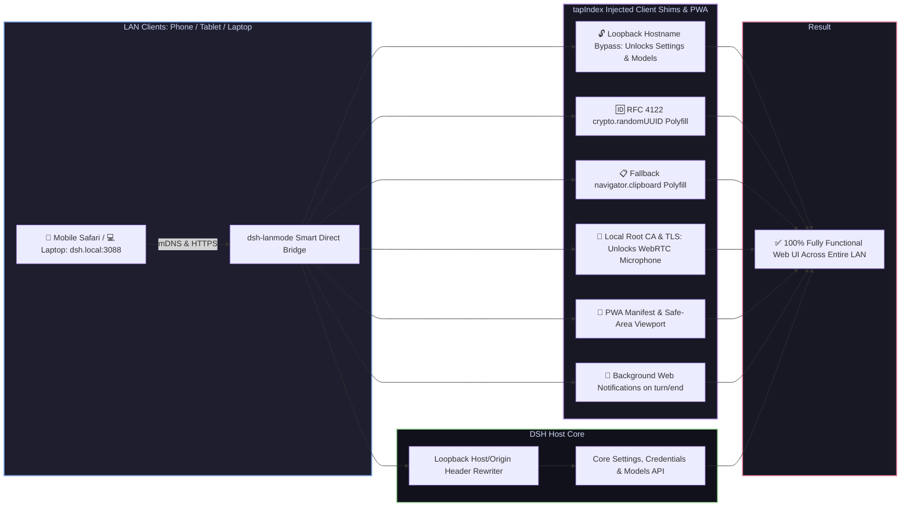

# 📦 @goodandready/dsh-lanmode

浏览器插件的异步初始化会保留其 await 生命周期。

<div align="center">

<h3>DeepSeek Harness 的局域网接入：mDNS（dsh.local）、PWA、根证书、二维码、后台通知与自动 TLS</h3>

<p align="center">
  <a href="https://www.npmjs.com/package/@goodandready/dsh-lanmode"></a>
  <a href="LICENSE"></a>
  <a href="https://github.com/topics/dsh-plugin"></a>
  <a href="https://nodejs.org"></a>
</p>

<p align="center">
  <a href="https://goodandready.app/"></a>
</p>

<p align="center">
  <a href="README.md"><b>🇬🇧 English</b></a> •
  <a href="README.ru.md"><b>🇷🇺 Русский</b></a> •
  <a href="README.zh.md"><b>🇨🇳 中文说明</b></a>
</p>

<table align="center">
  <tr>
    <td align="center">
      ⭐ <strong>如果这个插件对你有用，请在 GitHub 上加星</strong> — 这会让我知道它有价值，并促使我继续维护。
      <br><br>
      🐛 <strong>发现缺陷或想要新功能</strong>，可以用任何语言在 GitHub 提交 issue。我会查看建议，并把有用的想法放进后续版本。
    </td>
  </tr>
</table>

</div>

---

## ⚡ 为什么 DSH 在局域网上会失败

现代浏览器和 **DeepSeek Harness** 前端默认限制从非本机地址（例如 `192.168.x.x` 或 `10.x.x.x`）通过明文 HTTP 打开页面：

1. 🔒 **设置与模型页被锁住**：Web UI 用 `isLoopbackHostname` 判断主机名。从局域网打开时，设置服务退回内存模式：插件配置卡片是空的，分区状态变成 `"unavailable"`，修改在发送前被丢弃，**模型**页显示设置在此浏览器中不可用。
2. 💥 **UUID 生成直接崩溃**：`crypto.randomUUID()` 只存在于安全上下文（HTTPS 或 localhost）。局域网明文 HTTP 上，上传文件、调用工具和建立会话会立刻失败。
3. 📋 **剪贴板复制失效**：非安全来源上浏览器禁用 `navigator.clipboard`，代码片段的复制按钮不起作用。
4. 🎙️ **麦克风与语音输入被拦截**：明文 HTTP 上浏览器拒绝 `navigator.mediaDevices.getUserMedia`，手机和平板上的 [`dsh-voice`](https://github.com/GooDAnDReaDY/dsh-voice) 语音输入无法使用。
5. 🛡️ **核心 API 只接受回环**：核心方法（`/api/settings.*`、`/api/credentials.*`、`/api/models.*`）拒绝不是来自 `127.0.0.1` 的请求。

`dsh-lanmode` 用非侵入的 `webServer.tapIndex` HTML 垫片、直连桥、mDNS、根证书和设置卡片解决这些限制。



---

## ✨ 功能说明

### 1. 📱 `/mobileqr` 命令与即时二维码
* 注册工具 `/mobileqr`：生成带当前局域网地址和会话令牌的 SVG 二维码（`https://dsh.local:3088/?token=...`）。用手机相机对准屏幕即可连接。
* 设置卡片和 `/dsh-lanmode/health` 也能打开二维码。

### 2. 📲 PWA 与移动端独立窗口
* 路由 `/dsh-lanmode/manifest.json`，以及 `viewport-fit=cover`、`apple-mobile-web-app-capable`、`theme-color` 元标签。
* 移动端样式带有 `data-dsh-plugin="dsh-lanmode"`，宿主可以把它和其他插件的样式区分开。
* 在 iOS 或 Android 上把 DSH 加到主屏幕后，它以独立应用打开：没有浏览器地址栏，并避开刘海的安全区。
* `GET /dsh-lanmode/manifest.webmanifest` 是公开的，主屏幕安装不依赖会话。
* 已保存的启动令牌可以重新打开这个书签。清除站点数据后令牌消失。
* 扫描 `/dsh-lanmode/pair-accept?token=` 可以配对手机，且不设置 cookie。空令牌和长于 512 字符的令牌会被拒绝。
* 在手机上，二维码和设置共用页脚一行。长按会话行会打开它的菜单。模型菜单固定在屏幕底部。窄屏会收起宽桌面面板，其他插件仍然可见。
* 路径以 zip、exe、dmg、pkg、msi、7z、rar、gz、bz2、iso、bin 或 apk 结尾的聊天链接和文件打开会下载，而不是在页面里打开。

### 3. 🌐 自动 mDNS（`dsh.local`）
* 内置轻量 UDP 5353 应答：在局域网宣布 **`dsh.local`**。不必记住会变的 IP。

### 4. 🔐 长期信任的本地根证书
* 两级证书：**`dsh-lanmode Local Root CA`**（10 年）签发 **服务器证书**（SAN 包含 `dsh.local`、局域网 IP 和 localhost）。
* 下载 `GET /dsh-lanmode/ca.crt`：在 iPhone、iPad 或 Android 上安装一次，即可长期信任 HTTPS。[`dsh-voice`](https://github.com/GooDAnDReaDY/dsh-voice) 语音输入可以正常使用。
* 已保存的证书会在重启后继续使用。新签发的证书还会为每个地址带上 sslip.io 和 nip.io 名称。
* 这些名称只写进证书。桥不会在 sslip.io 或 nip.io 主机名上监听。
* `tlsSites` 为指定主机名增加证书和密钥文件。该主机名的请求使用自己的证书。IP、localhost 和未知名称仍用默认证书。空列表不会启用按名称选择。

### 5. 🔔 后台网页通知（turn/end）
* 接入 `turn/end` 和 `approval/asked` 会话事件。
* 标签页或手机不在前台（`document.hidden`）时发出系统通知。点通知会把聊天窗口带回前台。

### 6. 🎨 「设置 → 插件」里的设置卡片
* 符合 DSH 设计的插件卡片：
  * 连接状态与当前模式；
  * 一键复制局域网地址；
  * 卡片内开关二维码；
  * 一键开关后台通知；
  * 下载根证书（`ca.crt`）。

### 7. 🛡️ 访问控制、局域网 PIN 与安全
* **`unlockPrivileged`**：是否允许从局域网修改设置和凭据。
* **`lanPin` / `lanPinRef`**：特权操作的可选 PIN。开启后，局域网访客可以聊天，但修改系统设置、安装插件或改凭据需要验证 PIN。
* **暴力尝试限制**：同一 IP 连续 5 次 PIN 失败后返回 HTTP 429，并暂时锁定。
* **子网角色分离**：`adminAllow` 与 `guestAllow` 是分开的 CIDR。`guestAllow` 中的子网不能修改系统设置、吊销会话或切换 WAN 隧道（`403 Forbidden`）。
* **管理与诊断端点保护**：内部路由（`/dsh-lanmode/devices`、`/dsh-lanmode/devices/revoke`、`/dsh-lanmode/devices/kill-all`、`/dsh-lanmode/tunnel/toggle`、`/dsh-lanmode/api/interfaces`、`/dsh-lanmode/api/telemetry`、`/dsh-lanmode/api/config`）默认拒绝。绕过本地桥或从不受信任的网络访问时，需要有效的管理员凭据或受信任的回环来源。
* 登录、设置、设备吊销和隧道开关在请求体超过 64 KiB 时停止读取并返回 413，操作不会生效。
* **CSRF**：会改变状态的 POST 拒绝跨站请求（`Sec-Fetch-Site: cross-site`），并核对 Origin。
* 密码以 scrypt 摘要保存。会话令牌以 SHA-256 摘要保存，不保存原始令牌。更改密码会立即吊销该用户的其他会话。
* 用户名不存在和密码错误时，登录耗时相同。
* 局域网 PIN 使用 PBKDF2。同一地址连续失败 5 次后锁定 15 分钟。
* 第一次设置密码、密码引用或 `passwordAuth: true` 只能在本机完成。远程地址得到 403，配置保持不变。
* 密码认证保持开启时，不能把密码和密码引用同时清空。关闭密码认证仍然允许。
* `POST /dsh-lanmode/bans`，正文 `{ "ip" }`，用于封禁地址。该地址在登录页之前收到纯文本 `403 Forbidden`。不能封禁 loopback 和管理员自己的地址。名单保存在设备登记旁边。
* `disabledUsers` 中的用户名会在 5 秒内失去会话。
* 只有 `trustedProxyCidrs` 中的对端可以设置 `X-Forwarded-For` 和 `CF-Connecting-IP`。直连客户端不能伪造地址。
* 已登录的 API 返回 401 且带 `x-dsh-auth-required: 1` 时，页面会再次询问密码，不离开当前页，草稿保留。
* 登录卡片显示正在登录的主机名。

### 8. 📱 已连接设备与会话
* 实时记录客户端，并识别系统与浏览器（iOS、Android、Windows、macOS、Linux）。
* 在设置卡片中按设备吊销令牌，并提供「注销其他所有会话」。
* 桥上列出或吊销设备的路由只对管理员开放。访客得到 403。
* 每个设备行可以显示从 User-Agent 取出的短名称。
* 设备列表、隧道状态、更新检查或延迟请求失败时，卡片显示失败原因，而不是空的成功状态。

### 9. 🌐 多网卡与网格网络
* 自动识别本地局域网、Tailscale（100.x.y.z）、WireGuard 和 VPN 网卡，并用快捷按钮选择。
* 可为 Windows Defender Firewall、Linux UFW 和 firewalld 管理防火墙规则。

### 10. ⚡ 实时网络遥测与 HTTP/2 ALPN
* 小组件显示 RTT、并发连接数和传输字节。
* 桥同时支持 HTTP/2（ALPN `h2`）和 HTTP/1.1，便于多路复用的低延迟流。

### 11. 🚀 连接池与 SSE 隔离
* 到 DeepSeek Harness 的上游连接分成两个池：
  * **普通 HTTP 池**：keep-alive，最多 100 个可复用套接字，用于界面资源、脚本和 REST。队列超时默认 15 秒，饱和时返回 HTTP 503，而不是一直卡住。
  * **专用流池**：长连接单独处理，包括 Server-Sent Events、令牌流（`/api/chat/stream`）和实时通知。一百路以上的流不会占满界面和 API 的连接。响应体是管道转发，不会先收成一整块。
* 本地局域网客户端跳过 gzip 和 brotli。`adaptiveCompression` 开启时（默认开启），远程客户端仍可收到压缩响应。
* 未配置 harness 端口时，桥依次探测 `127.0.0.1` 的 3080、3081、3082。显式端口按原值使用。

### 12. ☁️ Cloudflare WAN 隧道与隧道 PIN
* 内置零配置 Quick Tunnel 和 Named Tunnel，无需端口转发即可从广域网访问。
* `tunnelPin: true` 时，来自广域网的请求必须通过 PIN。

### 13. 🔄 界面内一键更新
* 更新服务和设置卡片（`/api/dsh-lanmode/update`）：
  * 显示当前安装版本，以及 npm 上是否有新版本；
  * 安全边界：必须带 `x-dsh-plugin-update: 1`，并通过同源检查和管理员门禁。开启密码认证时，即使来自 loopback 也需要有效会话；未开启时，仅 loopback 或管理员网段可以更新。访客会被拒绝；
  * 在 DSH 设置卡片里一键升级 `@goodandready/dsh-lanmode`，不必使用终端。

---

## 📦 快速安装

```bash
dsh plugin --profile web add @goodandready/dsh-lanmode
```

---

## ⚙️ 配置参考（profile `cordis.patch.yml`）

自 v0.8.0（DSH 0.1.7+）起，配置写在 profile 行的 `config:` 里。
编辑 profile 的 `cordis.patch.yml` 可以覆盖默认值：

```yaml
# ~/.dsh/profiles/web/cordis.patch.yml
- id: dsh-lanmode
  config:
    mode: direct             # 'direct', 'proxy', or 'auto'
    directHost: 0.0.0.0      # Default: 127.0.0.1 (localhost only)
    directPort: 3080
    mdns: true               # Announce dsh.local in LAN
    pwa: true                # PWA manifest, splash screen & mobile viewport
    mobileEnterSends: false  # When false (default), Enter adds newline on mobile touch
    tls: self-signed         # 'self-signed' (with Root CA), 'files', or 'off'
    unlockPrivileged: true   # Permit settings & credentials from LAN
    lanPinRef: ""            # Credential reference name or ENV var for LAN PIN
    tunnel: off              # Cloudflare WAN tunnel: 'off', 'quick', or 'named'
    tunnelTokenRef: ""       # Credential reference name or ENV var for tunnel token
    tunnelPin: true          # Require PIN for requests from WAN
    allow:                   # Default: ['127.0.0.0/8'] (loopback only)
      - 192.168.0.0/16
      - 10.0.0.0/8
    passwordAuth: false
    authPasswordRef: ""
    publicHost: ""
    disabledUsers: []
    trustedProxyCidrs: []
    tlsSites: []
    adaptiveCompression: true
```

---

## 📄 许可证

MIT © [GooDAnDReaDY](https://github.com/GooDAnDReaDY)