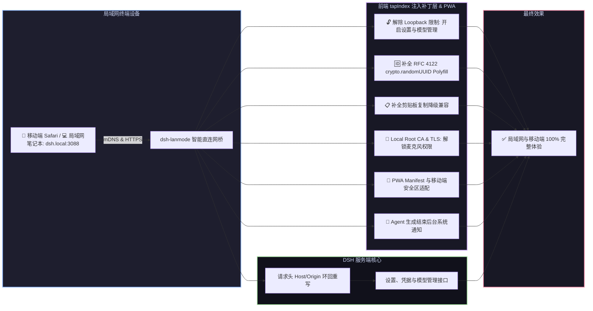

# 📦 @goodandready/dsh-lanmode

**修复 DSH 0.1.2-alpha.5 兼容性：** 保留异步插件初始化的等待语义，避免 Web UI
启动时服务尚未就绪。查看[兼容性测试](docs/testing/alpha5-compatibility.md)
和 [0.6.11 更新说明](docs/releases/0.6.11.md)。

<div align="center">

<h3>DeepSeek Harness 局域网访问优化、mDNS (dsh.local)、PWA、Root CA、QR 码、后台通知与自动 TLS 插件</h3>

<p align="center">
  <a href="https://www.npmjs.com/package/@goodandready/dsh-lanmode"></a>
  <a href="LICENSE"></a>
  <a href="https://github.com/topics/dsh-plugin"></a>
  <a href="https://nodejs.org"></a>
</p>

<p align="center">
  <a href="https://goodandready.app/"></a>
</p>

<p align="center">
  <a href="README.md"><b>🇬🇧 English</b></a> •
  <a href="README.ru.md"><b>🇷🇺 Русский</b></a> •
  <a href="README.zh.md"><b>🇨🇳 中文说明</b></a>
</p>

<table align="center">
  <tr>
    <td align="center">
      ⭐ <strong>如果您喜欢这个插件，请在 GitHub 上为它点亮 Star</strong> — 这能让我知道插件对您有用，并鼓励我继续开发和维护它。
      <br><br>
      🐛 <strong>如果您发现 Bug 或希望增加功能</strong>，请使用任意语言在 GitHub 上提交 Issue — 我会评估您的建议，并在后续版本中实现有价值的改进。
    </td>
  </tr>
</table>

</div>

---

## ⚡ 核心痛点：为什么局域网 IP 访问 DSH 会遭遇多重功能锁定

在纯 HTTP 环境下通过内网 IP（如 `192.168.x.x` 或 `10.x.x.x`）访问 **DeepSeek Harness** 时，浏览器与 DSH 前端会触发多项强制拦截：

1. 🔒 **设置与模型管理锁定**：前端检测 `!isLoopbackHostname` 将设置服务降级为只读内存态，所有插件配置卡片变空，模型页面提示 *"settings are unavailable in this browser"*；
2. 💥 **UUID 生成崩溃**：`crypto.randomUUID()` 仅在安全上下文存在，纯 HTTP 下调用直接报错崩溃；
3. 📋 **剪贴板复制失效**：`navigator.clipboard` 接口被禁用，代码块一键复制按钮无响应；
4. 🎙️ **麦克风语音输入拦截**：移动端浏览器禁止纯 HTTP 访问麦克风接口，导致 [`dsh-voice`](https://github.com/GooDAnDReaDY/dsh-voice) 语音功能瘫痪；
5. 🛡️ **核心 API 环回接口限制**：核心设置及密钥接口只接受来自 `127.0.0.1` 的请求。

`dsh-lanmode` 通过 `webServer.tapIndex` 动态注入无侵入 Polyfill 补丁、启动直连网桥、mDNS 域名解析、本地根证书（Root CA）生成以及客户端设置卡片，在局域网内 100% 恢复全功能体验。



---

## ✨ 核心特性

1. 📱 **/mobileqr 命令与二维码快速扫码连接**：一键生成纯 SVG 二维码与内网连接带 Token 链接，手机扫码秒进；
2. 📲 **PWA 与移动端全屏模式**：支持添加到主屏幕全屏无边框运行，完美适配刘海屏与状态栏；
3. 🌐 **自动 mDNS (`dsh.local`) 发现**：局域网内直接输入 `https://dsh.local:3088` 即可访问；
4. 🔐 **本地 Root CA 根证书**：提供 `GET /dsh-lanmode/ca.crt` 下载，安装至手机即可获得永久绿色可信 HTTPS；
5. 🔔 **后台系统通知（Web Notifications）**：当浏览器最小化或手机锁屏时，Agent 回复完毕自动推送系统通知；
6. 🎨 **UI 设置卡片（`lib/client.js`）**：无缝融入 DSH 设置面板，支持一键复制内网 URL 与切换二维码；
7. 🛡️ **访问控制、LAN PIN 与边界安全**：支持 CIDR 子网白名单、特权修改 PIN 验证及防暴力破解限流（连续 5 次失败触发 HTTP 429 锁定）。
8. 📱 **连接设备感知与会话管理**：自动识别客户端系统与浏览器，支持单设备吊销与一键下线其它设备；
9. 🌐 **多网卡与 Mesh 组网识别**：自动识别局域网、Tailscale、WireGuard 及 VPN 接口，提供界面快捷切换；
10. ⚡ **实时网络遥测与 HTTP/2 ALPN**：呈现 RTT 延迟、连接数及流量，支持 HTTP/2 `h2` 多路复用；
11. 🚀 **连接池与 SSE 流式传输隔离**：独立分配套接字处理长连接 SSE 与大模型流式输出，不占用常规 Web 资源；
12. ☁️ **Cloudflare WAN 隧道与远程 PIN 防护**：零配置远程访问，外网请求强制验证 PIN 码；
13. 🔄 **界面内一键平滑更新**：在设置卡片中一键安全更新插件。

---

## 📦 安装指南

```bash
dsh plugin --profile web add @goodandready/dsh-lanmode
```

---

## 📄 开源协议

MIT © [GooDAnDReaDY](https://github.com/GooDAnDReaDY)
