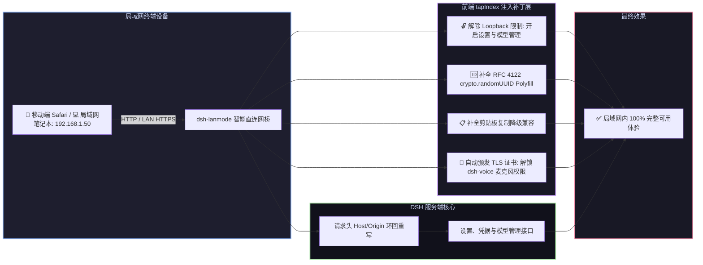

# 📦 @goodandready/dsh-lanmode

<div align="center">

<h3>DeepSeek Harness 局域网访问优化、安全上下文补丁、直连网桥与自动 TLS 插件</h3>

<p align="center">
  <a href="https://www.npmjs.com/package/@goodandready/dsh-lanmode"></a>
  <a href="LICENSE"></a>
  <a href="https://github.com/topics/dsh-plugin"></a>
  <a href="https://nodejs.org"></a>
</p>

<p align="center">
  <a href="README.md"><b>🇬🇧 English</b></a> •
  <a href="README.ru.md"><b>🇷🇺 Русский</b></a> •
  <a href="README.zh.md"><b>🇨🇳 中文说明</b></a>
</p>

</div>

---

## ⚡ 核心痛点：为什么局域网 IP 访问 DSH 会遭遇多重功能锁定

在纯 HTTP 环境下通过内网 IP（如 `192.168.x.x` 或 `10.x.x.x`）访问 **DeepSeek Harness** 时，浏览器与 DSH 前端会触发多项强制拦截：

1. 🔒 **设置与模型管理锁定**：前端检测 `!isLoopbackHostname` 将设置服务降级为只读内存态，所有插件配置卡片变空，模型页面提示 *"settings are unavailable in this browser"*；
2. 💥 **UUID 生成崩溃**：`crypto.randomUUID()` 仅在安全上下文存在，纯 HTTP 下调用直接报错崩溃；
3. 📋 **剪贴板复制失效**：`navigator.clipboard` 接口被禁用，代码块一键复制按钮无响应；
4. 🎙️ **麦克风语音输入拦截**：移动端浏览器禁止纯 HTTP 访问麦克风接口，导致 [`dsh-voice`](https://github.com/GooDAnDReaDY/dsh-voice) 语音功能瘫痪；
5. 🛡️ **核心 API 环回接口限制**：核心设置及密钥接口只接受来自 `127.0.0.1` 的请求。

`dsh-lanmode` 通过 `webServer.tapIndex` 动态注入无侵入 Polyfill 补丁、启动直连网桥及自动颁发局域网 TLS 证书，在局域网内 100% 恢复全功能体验。



---

## 📦 安装指南

```bash
dsh plugin --profile web add @goodandready/dsh-lanmode
```

---

## 📄 开源协议

MIT © [GooDAnDReaDY](https://github.com/GooDAnDReaDY)
